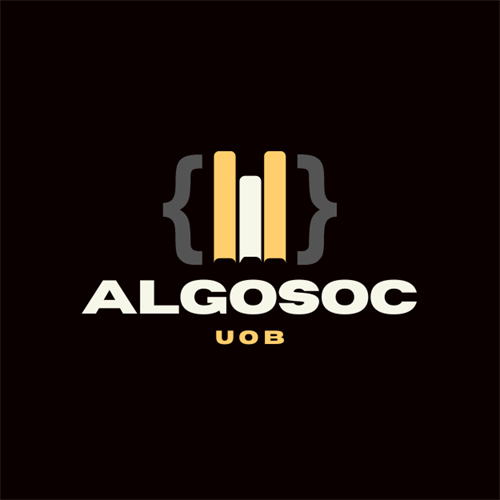

  

# AlgoSoc
Welcome to **AlgoSoc**, the Algorithms and Programming Society at the University of Birmingham!

Where algorithms meet innovation. Join our community of passionate programmers, competitive coders, and tech visionaries shaping the future of computing.

---

## 🌟 What We Offer

### 🛠️ Algorithm Workshops
Deep dive into data structures, algorithms, and problem-solving techniques with hands-on workshops and coding sessions.

### 🏆 Competitive Programming
Participate in coding competitions, hackathons, and programming contests. Sharpen your skills and compete with the best.

### 💼 Career Development
Get ready for the tech industry with technical interview prep, resume reviews, and networking opportunities with industry professionals and alumni.

---

## 🎯 Our Goals

- **Organising Talks and Events**: Collaborate with alumni, external societies, and industry speakers to prepare students for emerging roles in tech.  
- **Competitive Programming**: Host events throughout the year to simulate high-stakes scenarios like interviews and industry challenges.  
- **Accessibility for All**: Cater to students of all abilities, from beginner-friendly workshops to advanced exercises and collaborative events.

---

## 🤝 Memberships

- **Standard Membership**: For registered students.  
- **External Membership**: For alumni or staff.  

---

## 📢 Stay Connected

You can learn more about how to get a membership, as well as access our very own curated job boards at our **Website**:
 👉 [algosoc.uk](https://algosoc.uk)

Join our **Discord** to connect with like-minded members and stay updated on events and opportunities:
 👉 [discord.algosoc.uk](https://discord.algosoc.uk)

---

Join AlgoSoc to level up your coding skills, meet new people, and prepare for a successful career in tech! 🚀
